# Лабораторная 1 (обычная)

## Условие

Настроить nginx по заданному тз:
1. Должен работать по https c сертификатом
2. Настроить принудительное перенаправление HTTP-запросов (порт 80) на HTTPS (порт 443) для обеспечения безопасного соединения.
3. Использовать alias для создания псевдонимов путей к файлам или каталогам на сервере.
4. Настроить виртуальные хосты для обслуживания нескольких доменных имен на одном сервере.
5. Что угодно еще под требования проекта

**Результат**: Предположим, что у вас есть два пет проекта на одном сервере, которые должны быть доступны по https. Настроенный вами веб сервер умеет работать по https, относить нужный запрос к нужному проекту, переопределять пути исходя из требований пет проектов.

## Ход работы

### Предисловие

Для выполнения работы использовался локальный сервер, на котором находились два "пет-проекта". Оба сайта доступны по http, называются prjct1 и prjc2 соответственно.

Изначально они оба были размещены на локальном сервере и имеют свои доменные имена:

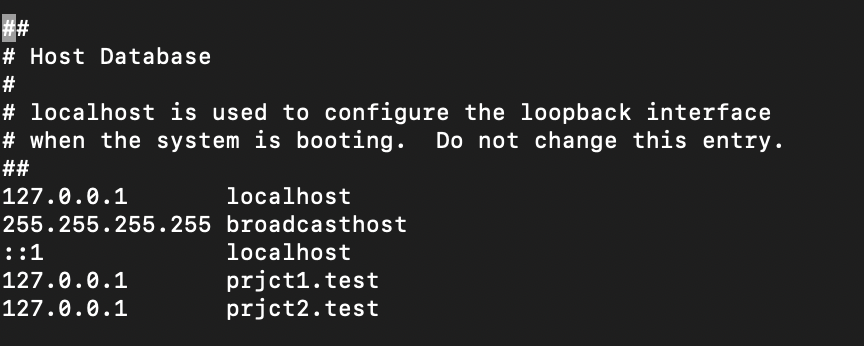

Сайты выглядели вот так и доступны по http:

---

### Шаг 1: Обеспечение доступа по https

Для обеспечения доступа по https необходимо сгенерировать SSL-сертификаты. Для решения задач данной работы подошла простая генерация сертификата с использованием OpenSSL:

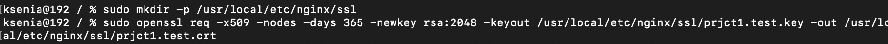

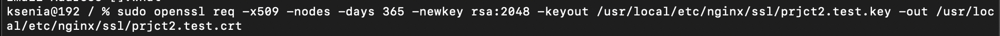

После генерации SSL-сертификатов nginx был настроен на слушание 443 порта (изменены настройки конфигурации в файлах nginx/servers/prjct1.test.conf и nginx/servers/prjct2.test.conf):

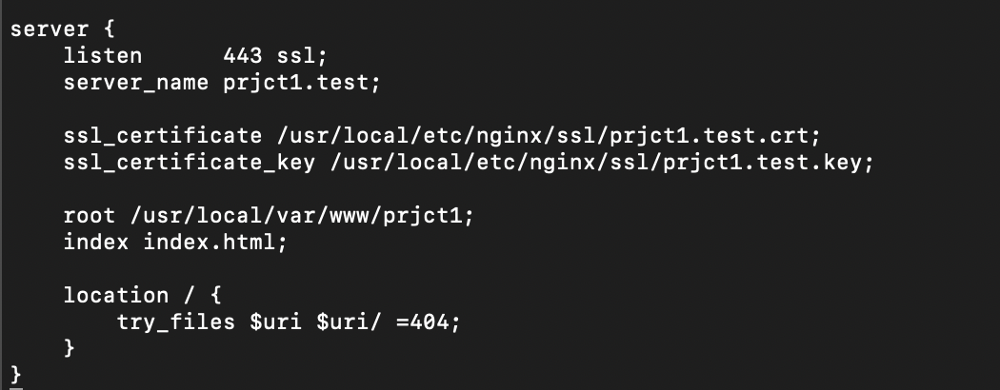

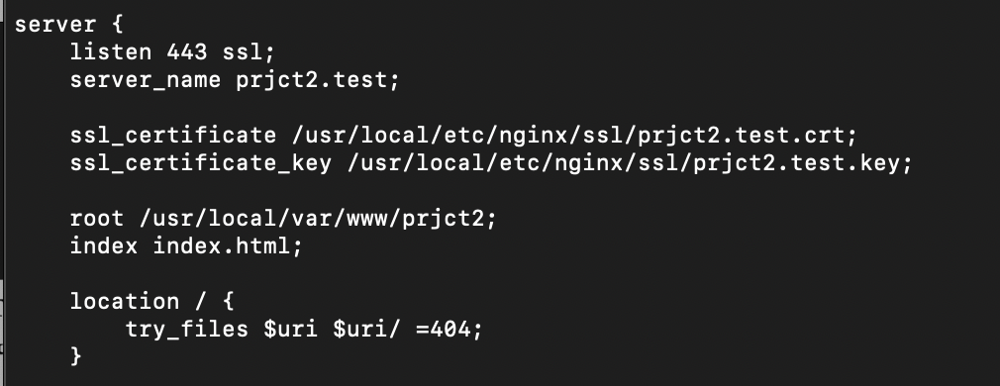

---

### Шаг 2: Настройка переадресации с http на https

Переадресация с 80 порта также была настроена в файлах конфигурации:

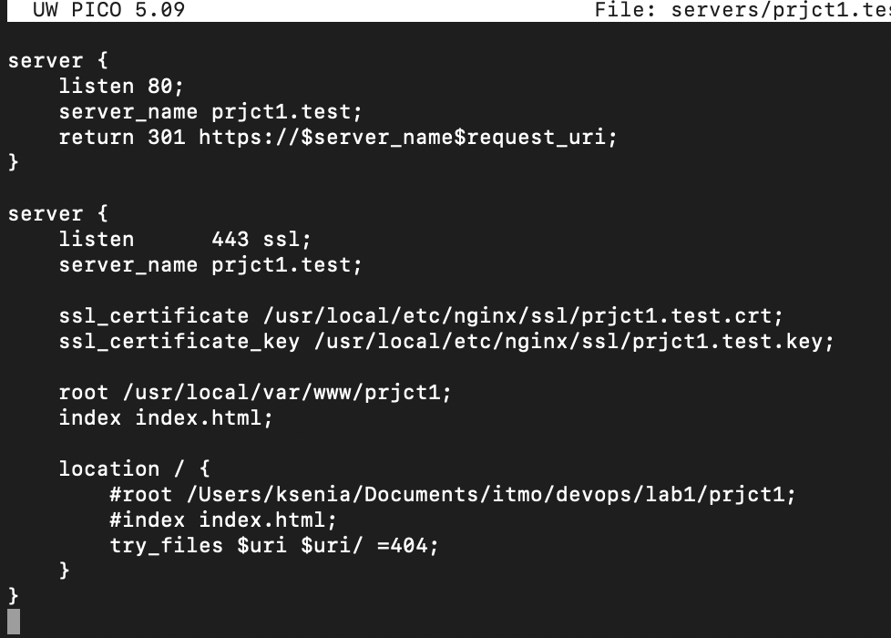

---

### Шаг 3: Настройка alias

Для доступа к другим картинкам с сайта prjct2 был настроен alias:

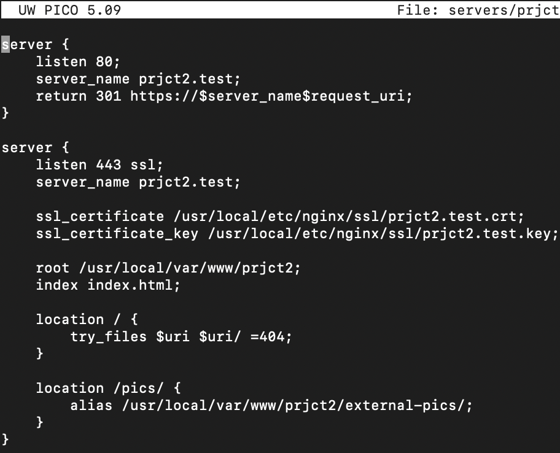

---

### Шаг 4: Перезапуск nginx и проверка работы сайтов

После изменения файлов конфигурации была проведена проверка на корректность внесенных изменений и перезапущен nginx:

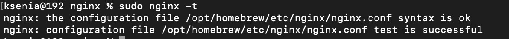

А также проверены доступы к сайтам. http теперь перенаправляется, сайты работают корректно, доступ через alias также работает:

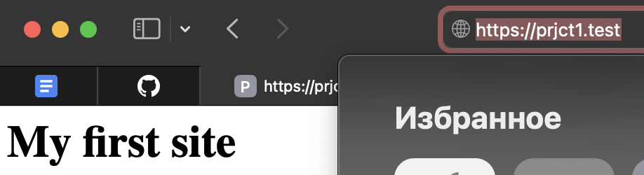

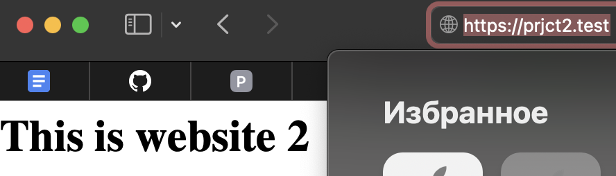

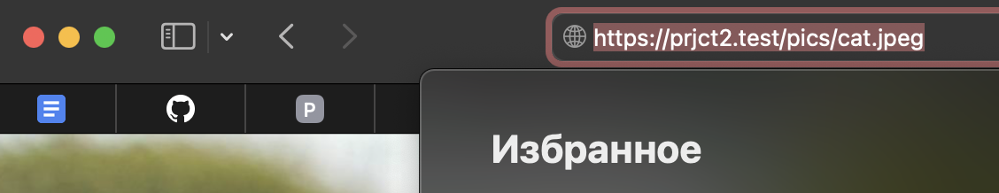

## Выводы

В ходе лабораторной работы была успешно настроена производственная среда веб-сервера nginx, соответствующая всем пунктам технического задания. Были развернуты два пет-проекта на одном сервере с поддержкой HTTPS, использованием самоподписанных SSL-сертификатов и автоматическим перенаправлением HTTP-запросов на защищенное соединение. Настроены виртуальные хосты для раздельного обслуживания доменных имен и применены alias-директивы для гибкого управления путями доступа к ресурсам.

В процессе выполнения работы были приобретены практические навыки конфигурирования веб-сервера,  работы с локальными доменами и SSL-сертификатами. Созданная инфраструктура демонстрирует готовность к развертыванию в production-среде после замены сертификатов на выпущенные доверенными центрами и добавления дополнительных мер безопасности.
