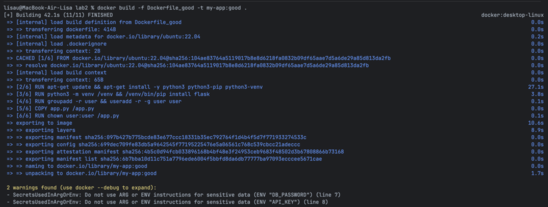
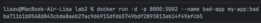
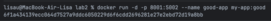
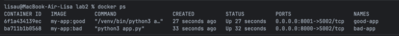
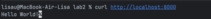

Лабораторная 2 (основная)
=========================
-----
## Задачи

- Написать “плохой” Dockerfile 
- Написать “хороший” Dockerfile
- Сравнить  “плохой” и “хороший”
- Косяки возможные в работе с контейнерами

--------------------------------
## Шаг 1: Подготовка
```
from flask import Flask
app = Flask(__name__)

@app.route('/')
def index():
    return 'Hello World!'

if __name__ == '__main__':
    app.run(host='0.0.0.0', port=5002)
```
Для наглядности создаем тестовое приложение в файле `app.py`

http://localhost:5002/ убеждаемся что на странице появилось "Hello World!"

## Шаг 2: “Плохой” Dockerfile
```dockerfile
FROM ubuntu:latest

RUN apt-get update
RUN apt-get install -y python3 python3-pip

RUN pip3 install --break-system-packages flask

ENV DB_PASSWORD="db_password"
ENV API_KEY="api_key"

COPY . /app
WORKDIR /app

CMD ["python3", "app.py"]
```

## Шаг 3: “Хороший” Dockerfile
```dockerfile
FROM ubuntu:22.04

RUN apt-get update && apt-get install -y python3 python3-pip python3-venv

RUN python3 -m venv /venv && /venv/bin/pip install flask

ENV DB_PASSWORD=""
ENV API_KEY=""

RUN groupadd -r user && useradd -r -g user user

COPY app.py /app.py

RUN chown user:user /app.py

USER user

CMD ["/venv/bin/python3", "app.py"]
```

## Шаг 4: Сравним  “плохой” и “хороший”
### Плохая практика №1
#### Использование тега: последний `latest`
```dockerfile
FROM ubuntu:latest
```
– Недетерминизм, не стабильность. Из-за изменения версий сборка может сломаться, новая версия может внести новые уязвимости. 

#### Решение
```dockerfile
FROM ubuntu:22.04
```
– Используем конкретные теги версий для полной предсказуемости

### Плохая практика №2
#### Запуск процессов от имени `root`
```dockerfile
CMD ["python3", "app.py"]
```
– Уязвимость безопасности, если в приложении найдется уязвимость, есть вероятность получения права root сторонними лицами.

#### Решение
```dockerfile
RUN groupadd -r user && useradd -r -g user user
RUN chown user:user /app.py
USER user
CMD ["/venv/bin/python3", "app.py"]
```
 – Создаем системную группу

 – Создаем системного пользователя

 – Изменяем владельца

 – Переключает контекст выполнения всех последующих команд на указанного пользователя

Безопасность обеспечивается тем что приложение запускается с минимальными разрешениями

### Плохая практика №3
#### Хранение секретов в образе
```dockerfile
ENV DB_PASSWORD="db_password"
ENV API_KEY="api_key"
```
– Не безопасное хранение данных.Секреты навсегда остаются в слоях образа. Их можно легко извлечь. Существует опасность слития данных при публикации образа.

#### Решение
```dockerfile
ENV DB_PASSWORD=""
ENV API_KEY=""
```
– Наши секреты не хранятся в образе, а передаются через переменные окружения при запуске.

### Плохая практика №4
#### Игнорирование .dockerignore файла
```dockerfile
COPY . /app
``` 
– Черевато попаданием секретных данных в образ, увеличивается сам размер образа, все это приводит к проблемам с безопаностью

#### Решение
```dockerfile
COPY app.py /app.py
```
– В образ попадают только конкретные файлы, что улучшает безопасность

### Плохая практика №5
#### Добавление лишних слоев
```dockerfile
RUN apt-get update
RUN apt-get install -y python3 python3-pip
```
– Создает лишние слои, вызывая проблемы с кешированием пакетов

#### Решение
```dockerfile
RUN apt-get update && apt-get install -y python3 python3-pip python3-venv
```
– Объединение команд уменьшает количество слоев

### Плохая практика №6
#### Игнорирование современных ограничений безопасности
```dockerfile
RUN pip3 install --break-system-packages flask
```
– Обход системных защит, что может привести к конфликтам пакетов

#### Решение
```dockerfile
RUN python3 -m venv /venv && /venv/bin/pip install flask
CMD ["/venv/bin/python3", "app.py"]
```
– Использование виртуального окружения для изоляции зависимостей

## Шаг 5: Тестирование
### Сборка Docker образов




### Запуск контейнеров






### Тестирование приложений





## Шаг 6: Косяки в работе с контейнерами
В возможные ошибки в работе с контейнерами, а не их сборке, можно включить: 
### Неиспользование restart policies
При любом падении приложения контейнер останавливается и пре перезагрузке сервиса контейнеры не запускаются автоматически. Для восстановления работы требуется ручное вмешательство. 
Вместо `docker run [имя образа]`, следует использовать `docker run --restart=unless-stopped [имя образа]`

### Запуск в неправильном режиме
`docker run -it [имя сервиса]` –эта команда опасна тем, что она держит STDIN(стандартный поток ввода) открытым и выделяет псевдо-TTY(псевдотерминал). То есть контейнер фактически привязан  к текущей терминальной сессии и при закрытии терминала контейнер получает SIGHUP(сигнал отбоя) и останавливается.
Чтоб этого избежать надо использовать: `docker run -d [имя сервиса]`. Контейнер будет работать в фоновом режиме, независимо от терминала. Так же это обеспечивает правильное логирование и легкую интеграцию в системы управления.

### Игнорирование ограничений ресурсов
`docker run [имя сервиса]` 
– Проблема в том, что 1 контейнер может исчерпать всю память хоста, из чего другие контейнеры/приложения начинают тормозить.
Правильно будет явно ограничить ресурсы. Примеры:

`docker run --memory=512m --memory-reservation=256m --cpus=1.0 [имя сервиса]` 
– `--memory=512m` – жесткий лимитом,  `--memory-reservation=256m` – c мягким лимитом и CPU ограничением до 1 ядра, причем делит ресурсы с другими контейнерами пропорционально

`docker run --memory=1g --cpus=2 --cpuset-cpus=0,1 [имя сервиса]`
– `--cpuset-cpus=0,1` - с закреплением за конкретными ядрами (0 и 1)

## Вывод
В ходе лабораторной работы были успешно продемонстрированы и исправлены ключевые антипаттерны Docker. Были изучены лучшие практики работы с контейнерами
