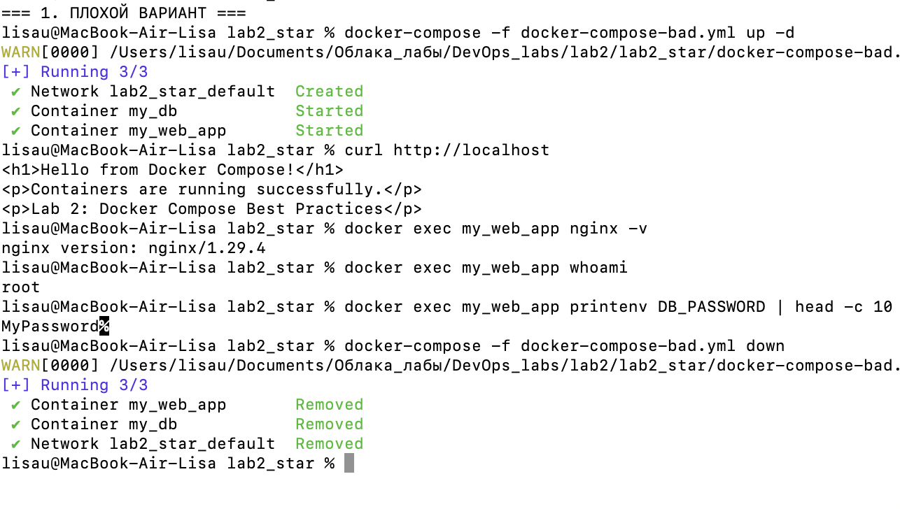
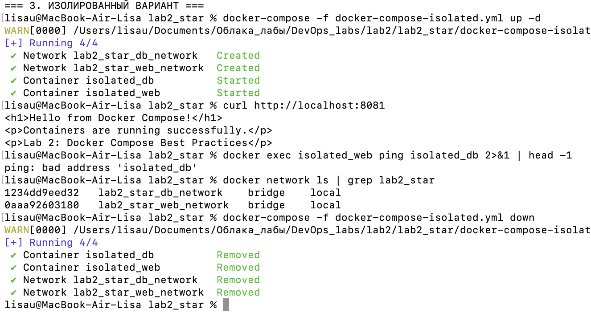

# Lab 2(*): Docker Compose - Плохие и хорошие практики

--------------------------------------------------------------------

## Цель

Изучить плохие практики  при написании Docker Compose файлов, научиться их исправлять и настраивать сетевую изоляцию между сервисами.

## Задачи

1. Создать "плохой" Docker Compose файл
 
2. Создать исправленный "хороший" Docker Compose файл
  
3. Реализовать сетевую изоляцию сервисов

### 1. Плохой вариант: `docker-compose-bad.yml`

```yaml
version: '3.8'

services:
  web:
    image: nginx:latest
    container_name: my_web_app
    ports:
      - "80:80"
    environment:
      DB_PASSWORD: MyPassword
    volumes:
      - ./public_html:/usr/share/nginx/html
    user: "nginx"

  db:
    image: postgres:latest
    container_name: my_db
    environment:
      POSTGRES_PASSWORD: MySuperPassword
```

### 2. Хороший вариант: `docker-compose-good.yml`

```yaml
version: '3.8'

services:
  web:
    image: nginx:${NGINX_VERSION:-1.25-alpine}
    container_name: good_web
    ports:
      - "${NGINX_PORT:-8080}:80"
    volumes:
      - ./public_html:/usr/share/nginx/html:ro
    environment:
      DB_PASSWORD: ${DB_PASSWORD}

  db:
    image: postgres:${POSTGRES_VERSION:-16-alpine}
    container_name: good_db
    environment:
      POSTGRES_PASSWORD: ${POSTGRES_PASSWORD}
```

### 3. Изолированный вариант: `docker-compose-isolated.yml`

```yaml
version: '3.8'

networks:
  web_network:
    driver: bridge
  db_network:
    driver: bridge

services:
  web:
    image: nginx:${NGINX_VERSION:-1.25-alpine}
    container_name: isolated_web
    ports:
      - "8081:80"
    volumes:
      - ./public_html:/usr/share/nginx/html:ro
    environment:
      DB_PASSWORD: ${DB_PASSWORD}
    networks:
      - web_network
    user: "nginx"

  db:
    image: postgres:${POSTGRES_VERSION:-16-alpine}
    container_name: isolated_db
    environment:
      POSTGRES_PASSWORD: ${POSTGRES_PASSWORD}
    networks:
      - db_network
```

### 4. Плохие практик: 
1)  Использование latest тега для образов
`image: nginx:latest` и `image: postgres:latest` - Последняя версия.Версия может меняться, что может привести к ошибкам и устаревшему коду.Так что лучше использовать стабильную версию.   
Исправляем на `image: nginx:1.25-alpine` и `image: postgres:16-alpine`. Фиксированная версия обеспечивает детерминированность. Теперь гораздо меньше уязвимостей.

2)  Секреты в открытом виде
```yaml
environment:
  DB_PASSWORD: MyPassword
  POSTGRES_PASSWORD: MySuperPassword
```
Пароли прямо в открытом доступе, что не безопасно. Большой риск утечки при commit в Git.Так же невозможно использовать разные пароли для разных окружений. Поэтому пишем 

```yaml
environment:
  POSTGRES_PASSWORD: ${DB_PASSWORD}
``` 
Создаем .env файл с нашими паролями. Теперь у нас обеспечивается защита конфиденциальных данных. 

3. Запуск от пользователя root
Процессы с максимальными привилегиями, что делает риски безопасности. То есть контейнер по умолчанию от root запускается. 
`user: "nginx"` - запускаем от пользователя nginx. То есть решение это явное указание непривилегированных пользователей

4. Отсутствие сетевой изоляции
И по последнему пункту у нас все сервисы в одной сети. Что юязвимо к атакам. Поэтому разделяем сети для каждого сервиса.
```yaml
networks:
  web_network:
    driver: bridge
  db_network:
    driver: bridge
```

### 5. Подробнее о принципах сетевой изоляции

Техническая реализация:
```yaml
networks:
  web_network:
    driver: bridge
  db_network:
    driver: bridge
services:
  web:
    networks: ["web_network"] 
  db:
    networks: ["db_network"]  
```

Каждый сервис создает сетевой интерфейс только в своей сети, так же DNS имена разрешаются только внутри одной сети. Соединение же между сетями невозможно установить.Так веб-сервер доступен извне, но не может подключиться к БД.

### Вывод 

Лабораторная работа успешно продемонстрировала критическую важность следования best practices в Docker Compose: переход от опасных "latest" тегов и открытых секретов к фиксированным версиям и защищённым .env-файлам, от запуска от root к непривилегированным пользователям, и главное — от общей уязвимой сети к полной изоляции сервисов через раздельные сети, что подтверждается ошибкой ping: bad address и предотвращает горизонтальное перемещение атак в production-средах.

Скриншот 1: Структура проекта

Структура файлов проекта в репозитории GitHub

Скриншот 2: Docker Compose файлы

Содержимое Docker Compose файлов: плохой, хороший и изолированный варианты

Скриншот 3: Выполнение команд

Выполнение Docker команд и проверка работы контейнеров
